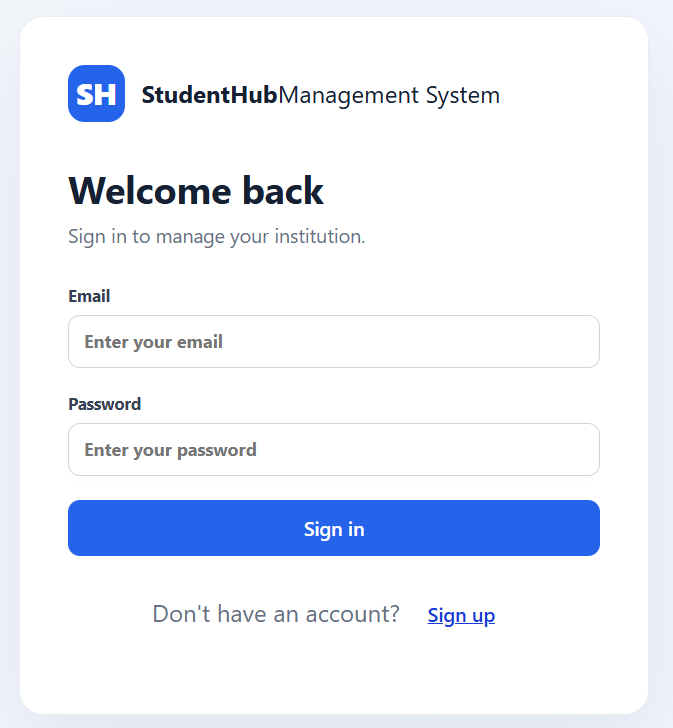
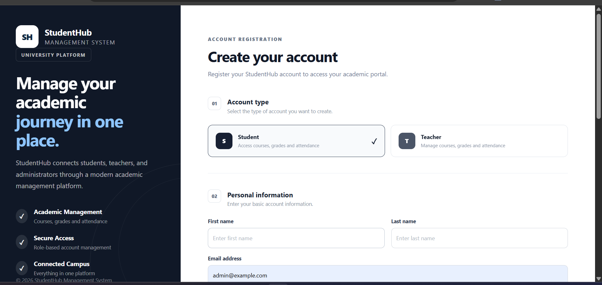
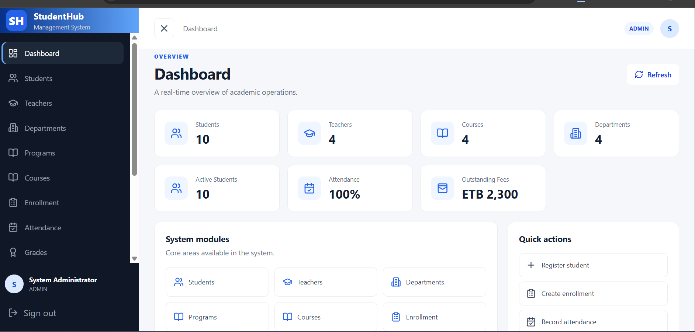
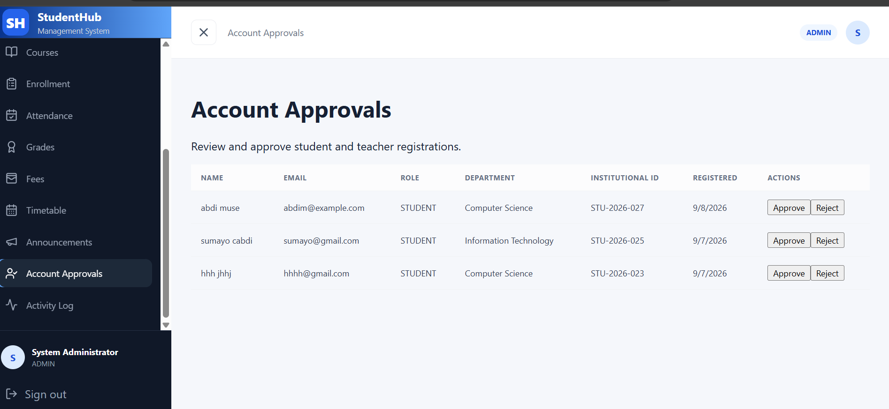

# StudentHub Management System

StudentHub is a web-based Student Management System designed to help
educational institutions manage students, teachers, departments,
programs, courses, enrollment, attendance, grades, fees, timetables,
announcements, and user accounts.

## Features

### Authentication & User Management

- User registration
- Administrator account approval
- Role-based authentication
- Secure password hashing
- JWT-based authentication
- Account status management

### Administration

- Admin dashboard
- Account approvals
- Activity log
- Student management
- Teacher management
- Department management
- Program management

### Academic Management

- Course management
- Enrollment management
- Attendance management
- Grade management
- Fee management
- Timetable management
- Announcements

### Student Features

- Student dashboard
- Student enrollment information
- Academic information
- Attendance information
- Account management

---

## Screenshots

### Login

### Registration

### Admin Dashboard

### Account Approvals

### Student Management

### Enrollment

### Student Dashboard

---

## Technology Stack

### Frontend

- React
- TypeScript
- React Router
- Vite
- Lucide React

### Backend

- Node.js
- Express
- JWT
- bcrypt
- CORS
- MySQL2

### Database

- MySQL

## Project Structure

student-management-system-fi/
│
├── client/
│ ├── src/
│ ├── index.html
│ ├── package.json
│ └── .env.example
│
├── server/
│ ├── src/
│ ├── uploads/
│ ├── package.json
│ └── .env.example
│
├── database/
│ ├── schema.sql
│ └── seed.sql
│
├── screenshots/
│ ├── login.png
│ ├── register.png
│ ├── admin_dashboard.png
│ ├── account_approvals.png
│ ├── students.png
│ ├── enrollments.png
│ └── student_dashboard.png
│
├── .gitignore
├── package.json
└── README.md

## installation & setup

### prerequisites

Before running StudentHub, install:

    Node.js
    npm
    MySQL or MariaDB
    Git

Verify Node.js and npm:

    node --version
    npm --version

1.Clone the repository:

    git clone https://github.com/barkhad-olaad/student-system.git
    cd student-system

2. Install Dependencies

Install the root dependencies:

    npm install

Then install the frontend and backend dependencies:

    npm run install-all

3. Configure the Database

Create a MySQL database in XAMPP named:

student_management

Then run the database schema:

database/schema.sql

If you want the sample/demo data, also run:

database/seed.sql

4. Configure the Backend

Inside the server directory, create a file named:

    .env

Use server/.env.example as the template.

Never commit your real .env file or database credentials to GitHub.

5. Configure the Frontend

Inside the client directory, create:

    .env

Based on client/.env.example:

VITE_API_URL=http://localhost:5000/api

6. Running the Application

Option 1 — Run Frontend and Backend Together

From the project root:

    npm run dev

The root project is configured to start both the server and client concurrently.

The application will normally be available at:

http://localhost:5173

The backend runs on:

http://localhost:5000

Option 2 — Run Separately

Start the backend

    npm run server

Start the frontend

Open another terminal:

    npm run client

## Future Features

The following features are planned for future releases of StudentHub:

### Authentication & User Management

- Password reset and account recovery
- Email verification
- User profile management
- Profile photo upload
- Change password functionality
- Improved session and token management
- Account activation, suspension, and deactivation controls

### Registration & Approval Workflow

- Registration status tracking
- Administrator approval notifications
- Rejection reasons and resubmission
- Registration history
- Email notifications for approval and rejection
- Improved application review interface

### Student Management

- Advanced student search and filtering
- Student profile enhancements
- Student document management
- Student ID generation
- Printable student ID cards
- Academic history
- Student transfer and withdrawal management

### Teacher Management

- Teacher profile management
- Teacher workload management
- Teacher availability
- Teacher assignments
- Teacher performance records

### Academic Management

- Academic year and semester management
- Class and section management
- Course prerequisites
- Course scheduling improvements
- Academic calendar
- Curriculum management

### Attendance

- Attendance reports
- Attendance statistics and analytics
- Bulk attendance entry
- Attendance notifications
- Exportable attendance reports

### Grades & Results

- Grade calculation and GPA management
- Semester result generation
- Student transcripts
- Printable academic reports
- Grade analytics
- Result publishing controls

### Finance

- Student payment management
- Fee structures
- Payment history
- Outstanding balance tracking
- Financial reports
- Printable receipts

### Communication

- In-system notifications
- Email notifications
- Announcement targeting by role, department, or program
- Student-teacher communication
- Important event reminders

### Reports & Analytics

- Student enrollment statistics
- Attendance analytics
- Academic performance analytics
- Financial reports
- Teacher workload reports
- Dashboard charts and visualizations
- PDF and Excel report exports

### System Administration

- Role and permission management
- System settings
- Audit-log improvements
- Backup and restore tools
- Data import and export
- System activity monitoring

### User Experience

- Dark mode
- Theme preferences
- Responsive mobile interface
- Improved accessibility
- Advanced dashboard customization
- Improved navigation and search
- Consistent StudentHub design system

### Security

- Two-factor authentication (2FA)
- Login attempt monitoring
- Account lockout protection
- Improved authorization controls
- Security audit improvements

### Deployment

- Production deployment configuration
- Docker support
- Cloud database support
- CI/CD integration
- Production environment configuration
- Automated database backups

> **Note:** These features are planned and may be introduced incrementally in future releases.

## Project Status

🚧 Active development

This project is currently under development. Features and UI are
still being improved.
